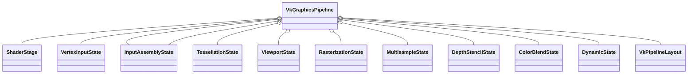

# VkPipeline

VkPipeline描述了一次DrawCall中管线需要的数据和被设置的状态

## Shader

#### VkShaderModules

##### VkShaderModuleCreateInfo

- codeSize：二进制数组内存大小
- pCode：二进制数组指针

#### VkPipelineShaderStageCreateInfo

- stage  shader的类型，包括vs，ps, hs, gs等等
- module  包含shader字节码的VkShaderModules
- pName   shader的名字
- pSpecializationInfo  ???

## 顶点输入

#### VkVertexInputBindingDescription

- binding 顶点属性的binding，交叉顶点属性只有一个
- stride 顶点buffer中每个顶点所占用的内存大小
- inputRate  数据是按照逐顶点还是逐instance

#### VkVertexInputAttributeDescription

- binding	顶点数据在哪个组中国
- location    顶点数据在vertex buffer中的位置
- format      顶点数据的格式
- offset        顶点数据的偏移值

#### VkPipelineVertexInputStateCreateInfo

## 输入装配

#### VkPipelineInputAssemblyStateCreateInfo

- topology 描述了顶点数据定义了哪个类型的几何图元
- primitiveRestartEnable 是否可以特殊索引值复用顶点

## 视口和裁剪

## Rasterization

#### VkPipelineRasterizationStateCreateInfo

- depthClampEnable 	设置为true时，在近平面和远平面 外的片段会被截断为在近平面和远平面上，而不是直接丢弃这些片段
- rasterizerDiscardEnable 设置为TRUE表示所有几何图元 都不能通过光栅化阶段
- polygonMode   填充模式或者是wireframe
- cullMode 表面剔除类型。背面，正面或者双面
- frontFace 成员变量用于指定顺时针的顶点序是正面，还是逆时针的顶点序是正面
- lineWidth  用于指定光栅化后的线段宽度，它以线宽所占的片 段数目为单位。线宽的最大值依赖于硬件。
- depthBiasEnable 光栅化程序可以添加一个常量值或是一个基于片段所处线段的斜率得 到的变量值到深度值上。这对于阴影贴图会很有用

## 多重采样

#### VkPipelineMultisampleStateCreateInfo

- rasterizationSamples 每个像素几个采样点
- sampleShadingEnable 字段决定是否启用Sample Shading。Sample Shading可以完成平滑颜色变化过大的锯齿
- minSampleShading字段指定了在sampleShadingEnable设置为VK_TRUE的情况下采样着色的最小次数
- pSampleMask字段是一个指针，指向用于采样Mask测试的VkSampleMask值数组。
- alphaToCoverageEnable字段控制是否根据多样本覆盖部分中指定的片段的第一颜色输出的alpha分量生成临时覆盖值。
- alphaToOneEnable字段控制是否按照多样本覆盖部分所述，将片段的第一个颜色输出的alpha分量替换成一个

## 深度和模板测试

#### VkPipelineDepthStencilStateCreateInfo

- depthTestEnable
- depthWriteEnable
- depthCompareOp
- depthBoundsTestEnable 开启后只有minDepthBounds和maxDepthBounds范围内的fragment才不会被丢弃
- stencilTestEnable
- front
- back

## 颜色混合

#### VkPipelineColorBlendAttachmentState

可以用它来对每个绑定的帧缓冲进行单独的颜色混合配置

- blendEnable 
- srcColorBlendFactor 当前片段的输出颜色所占的比例
- dstColorBlendFactor 缓存区中颜色所占的比例
- colorBlendOp
- srcAlphaBlendFactor
- dstAlphaBlendFactor
- alphaBlendOp
- colorWriteMask  以上设置对哪个通道起作用

#### VkPipelineColorBlendStateCreateInfo

可以用它来进行全局的颜 色混合配置

- logicOpEnable  false时使用VkPipelineColorBlendAttachmentState设置的混合方式，true时使用logicOp    指定的混合方式
- logicOp    混合方式
- attachmentCount
- pAttachments    VkPipelineColorBlendAttachmentState数组
- blendConstants

## 动态状态

只有非常有限的管线状态可以在不重建管线的情况下进行动态修改

#### VkPipelineDynamicStateCreateInfo

## PipelineLayout

与shader中的Uniform变量Sampler变量和pushContant变量有关，可以看作是一个通用的模板

#### VkDescriptorSetLayoutBinding

- binding 在set的第几个位置
- descriptorType 数据的类型，比如uniformBuffer或者sampler
- descriptorCount 数据的个数
- stageFlags 数据在哪个shader中被使用
- pImmutableSamplers 不可变的采样器

#### VkDescriptorSetLayoutCreateInfo

- bindingCount
- pBindings `VkDescriptorSetLayoutBinding`数组

#### VkDescriptorSetLayout

#### VkPushConstantRange

不需要存在内存中的Uniform变量，无需VkBuffer就可以直接用命令推送到管线

- stageFlags 在vs还是ps中用到了
- offset 数据的偏移
- size 数据的大小

#### VkPipelineLayoutCreateInfo

- pSetLayouts `VkDescriptorSetLayout`数组
- pPushConstantRanges `VkPushConstantRange`数组

#### VkPipelineLayout

