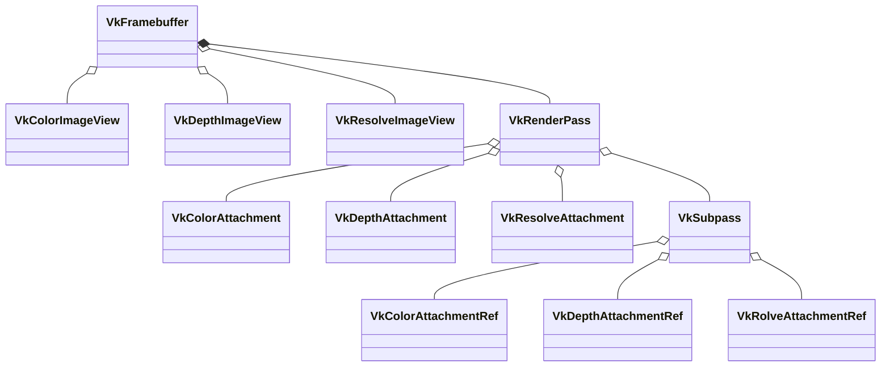

# VkRenderPass

## SwapChain

本质上是一个包含了若干等待呈现的图像的队列，类似与生产者消费者，管线通过渲染填充这个队列中的图像，放入到队列中，等待屏幕呈现。

在创建逻辑设备之前，需要检查物理设备是否支持VK_KHR_swapchain扩展，并且添加到逻辑设备支持的扩展中

接下来需要选择队列中图像的尺寸，格式，颜色空间以及交换链中的图像数量，交换链的呈现方式等等

```c
//最大最小数量
//图像的最大最小尺寸
VkSurfaceCapabilitiesKHR surfCaps;
fpGetPhysicalDeviceSurfaceCapabilitiesKHR(physicalDevice, surface, &surfCaps);

// 
uint32_t presentModeCount;
fpGetPhysicalDeviceSurfacePresentModesKHR(physicalDevice, surface, &presentModeCount, NULL)
std::vector<VkPresentModeKHR> presentModes(presentModeCount);
fpGetPhysicalDeviceSurfacePresentModesKHR(physicalDevice, surface, &presentModeCount, presentModes.data());

// https://zhuanlan.zhihu.com/p/46730180
```

四种呈现方式：

- IMMEDIATE	应用程序提交的图像会被立即传输到屏幕上
- FIFO 先进先出的队列，当队列满时，应用程序进行等待
- FIFO_RELAXED 当队列空时，下一次提交的图形会被立刻呈现在屏幕上
- MAILBOX 交换链的队列满时阻塞应用程序，队列中的图像会被直接替换为应用程序新提交的图像，这一模式可以用来实现三倍缓冲，避免撕裂现象的同时减小了延迟问题

#### VkSwapchainCreateInfoKHR

- surface 图形被呈现给surface

- minImageCount 队列的最小数量

- imageFormat 

- imageColorSpace 是否支持sRGN

- imageExtent 图像尺寸

- imageUsage 应该为VK_IMAGE_USAGE_COLOR_ATTACHMENT_BIT，图像作为绘制附件，后期处理需要VK_IMAGE_USAGE_TRANSFER_DST_BIT

- imageSharingMode

  多个队列族中的队列命令如何使用图像

  VK_SHARING_MODE_EXCLUSIVE 一张图像同一时间只能被一个队列族所拥有，性能最佳

- presentMode 呈现模式

- clipped 被其他应用程序遮住的像素是否需要被处理

- oldSwapchain 交换链重建时，旧的交换链对象

#### vkCreateSwapchainKHR

#### VkSwapchainKHR

创建完成后，可以通过下列方式获取图像

```c
vkGetSwapchainImagesKHR(device, swapChain, &imageCount, NULL);
vkGetSwapchainImagesKHR(device, swapChain, &imageCount, images.data());
```

## VkFramebuffer

帧缓冲通过VkImageView引用了实际用于渲染的VkImage，用于RenderPass的Attachments。和SwapChain中的VkImage是一对一的关系，所以我们需要定义和SwapChain中的VkImage数量一样的VkFramebuffer。

除此之外，还需要额外两张的VkImage分别作为Depth Attachment和Resolve Attachment

#### VkFramebufferCreateInfo

- attachmentCount attachment的数量
- pAttachments attachment的VkImageView数组
- width，height 宽高
- layers 一般为1，vr可能需要更多
- renderPass 

## VkRenderPass

RenderPass本质是定义一个完整的渲染流程以及使用的所有资源的描述，可以理解为是一份元数据或者占位符的概念，其中不包含任何真正的数据，而通过`VkFramebuffer`这一结构获取真正的数据。

#### VkAttachmentDescription

Attachment是资源描述(元数据)，定义了一些加载/存储操作以及相应资源的格式。一个Attachment对应于一个VkImageView，创建RenderPass时需要提供一组Attachment，表示color，depth和resovle。

- format 格式
- samples 采样数，一般为VK_SAMPLE_COUNT_1_BIT，msaa时配置为其他值
- loadOp 指定在一次管线流程中首次使用Attachment的SubPass加载时如何处理的Color或者Depth组件的内容
- storeOp 指定在最后使用该Attachment的SubPass结束时如何存储其Color或者Depth组件的内容
- stencilLoadOp 在第一次使用的SubPass加载时如何处理Attachment的Stencil组件的内容
- stencilStoreOp 在最后一个使用SubPass结束时如何存储Attachment的Stencil组件的内容
- initialLayout  RenderPass实例开始时Attachment Image子资源的布局
- finalLayout 当RenderPass实例结束时Attachment Image子资源将被转换到的布局

如果一个Attachment不被任何SubPass使用，那么对于该Attachment的loadOp、storeOp、stencilStoreOp和stencilLoadOp将被忽略，并且不会执行任何加载或存储操作。但是initialLayout和finalLayout指定的布局过渡仍将被执行

#### VkAttachmentReference

通过VkAttachmentReference结构为SubPass指定使用在RenderPass中包含的具体的哪个Attachment，且SubPass之间Attachment的布局可能会发生变化，因此需要在每个SubPass的基础上通过layout字段来描述

- attachment 数组中的位置
- layout 在该subpass中使用的布局

#### VkSubpassDescription

对subpass的描述，定义了subpass执行时可以操作的资源

- pipelineBindPoint subpass的pipeline类型，一般为graphics
- colorAttachmentCount color attachment的数量
- pColorAttachments `VkAttachmentReference`，描述了具体使用哪个Attachment作为color
- pDepthStencilAttachment `VkAttachmentReference`描述了具体使用哪个Attachment作为depth
- pResolveAttachments MSAA时会用到

#### VkSubpassDependency

定义subpass之间的依赖关系，定义同步顺序。

- srcSubpass 第一个SubPass的索引或者是VK_SUBPASS_EXTERNAL
- dstSubpass 是第二个SubPass的索引
- srcStageMask 用于指定源阶段掩码
- dstStageMask 用于指定目标阶段掩码
- srcAccessMask 源的内存操作
- dstAccessMask 等待的内存操作
- dependencyFlags

#### VkRenderPassCreateInfo

- attachmentCount
- pAttachments
- subpassCount
- pSubpasses
- dependencyCount
- pDependencies



