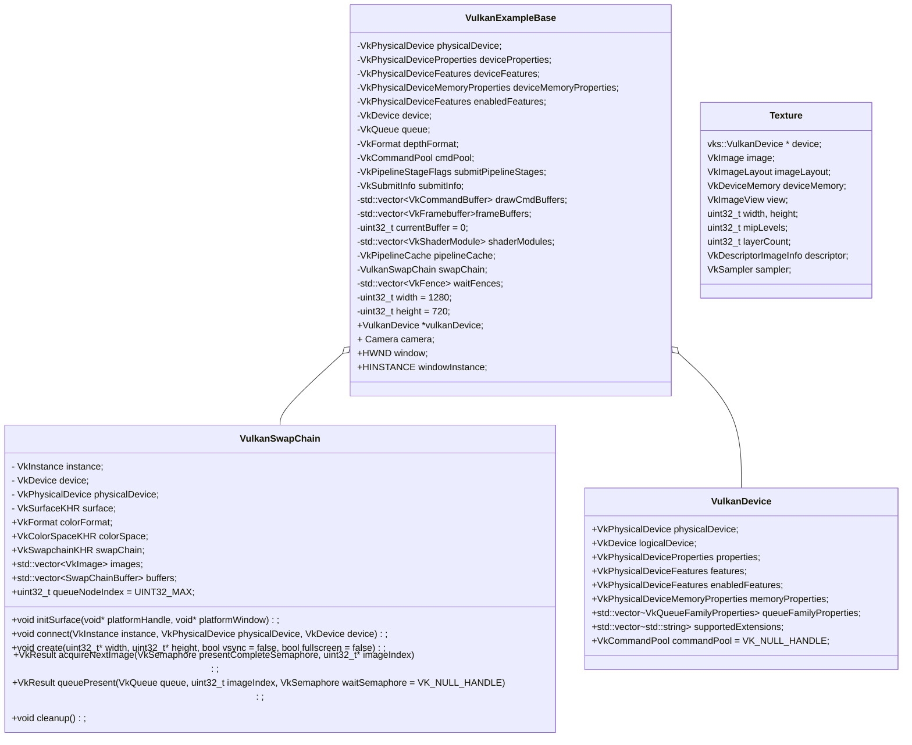

## 框架详解

[TOC]


#### 类图



#### 流程

```c++
int main
{
    // 处理commandline, console等信息
    vulkanExample = new VulkanExample();
    
    vulkanExample->initVulkan();
    {
        VkResult VulkanExampleBase::createInstance(bool enableValidation);
        {
            // 获取支持的Extension
         	// 获取已经启用的Extension
            //校验层设置
         
            //创建VkInstance
            vkCreateInstance(&instanceCreateInfo, nullptr, &instance);
        }
        
        // 获取GPU，封装为VkPhysicalDevice，使用第一个作为程序使用的VkPhysicalDevice
        std::vector<VkPhysicalDevice> physicalDevices(gpuCount);
        err = vkEnumeratePhysicalDevices(instance, &gpuCount, physicalDevices.data());
        physicalDevice = physicalDevices[selectedDevice];
        
        // 
        vulkanDevice = new vks::VulkanDevice(physicalDevice);
        {
            // 获取GPU的属性，限制，内存信息等等

            // 获取队列簇属性
            
            // 获取支持的扩展
        }
        
        // 创建逻辑设备
        VkResult res = vulkanDevice->createLogicalDevice(enabledFeatures, enabledDeviceExtensions, deviceCreatepNextChain);
        {
            // 填写VkDeviceQueueCreateInfo结构体，指定要创建的队列类型和其他信息
            
            // 添加使用swapChain的扩展
            
            // 创建VkDevice，逻辑设备
            VkResult result = vkCreateDevice(physicalDevice, &deviceCreateInfo, nullptr, &logicalDevice);
            //创建默认的commandPool
            commandPool = createCommandPool(queueFamilyIndices.graphics);
        }
        
            // Get a graphics queue from the device
        vkGetDeviceQueue(device, vulkanDevice->queueFamilyIndices.graphics, 0, &queue);

        // Find a suitable depth format
        VkBool32 validDepthFormat = vks::tools::getSupportedDepthFormat(physicalDevice, &depthFormat); 
        
        // 获取创建swapChain扩展的方法指针
        swapChain.connect(instance, physicalDevice, device);
        
        // 异步处理
        // 提交处理
    }
    
    // 创建window
    HWND VulkanExampleBase::setupWindow(HINSTANCE hinstance, WNDPROC wndproc);
    
    void VulkanExample::prepare()
    {
        VulkanExampleBase::prepare();
        {
            void VulkanExampleBase::initSwapchain()
            {
                void VulkanSwapChain::initSurface(void* platformHandle, void* platformWindow)
                {
                    // 根据窗口信息创建Surface
                    vkCreateWin32SurfaceKHR(instance, &surfaceCreateInfo, nullptr, &surface);
                    
                    // 获取支持present的queue
                    // 设置colorFormat和ColorSpace
                }
            }
            
            void VulkanExampleBase::createCommandPool();
         
            void VulkanExampleBase::setupSwapChain()
            {
                swapChain.create(&width, &height, settings.vsync, settings.fullscreen);
                {
                    // 获取surface的的属性和格式
                    // 获取支持presentMode
                    // 获取surface的宽高
                    
                    // 填充VkSwapchainCreateInfoKHR结构体
                    // 创建Swapchain
                	VK_CHECK_RESULT(fpCreateSwapchainKHR(device, &swapchainCI, nullptr, &swapChain));
                    
                    // 获取vkImage数量
                    // 创建vkImageView
                }
            }
            
            // Create one command buffer for each swap chain image and reuse for rendering
            // 为swapChain中的每一个image创建一个command buffer
            void VulkanExampleBase::createCommandBuffers();
            
            // 为cpu与gpu同步创建fence
            void VulkanExampleBase::createSynchronizationPrimitives();
            
            void VulkanExampleBase::setupDepthStencil();
            {
                // 创建depthStencil的image、mem、以及ImageView
            }
            //创建RenderPass
            void VulkanExampleBase::setupRenderPass();
            
            //创建PipelineCache
            void VulkanExampleBase::createPipelineCache();
            
            // 为每个swapChain的Image创建一个FrameBuffer
            void VulkanExampleBase::setupFrameBuffer()；
        }
        
        
    }
}
```

## Vulkan概念

### VkInstance

初始化Vulkan library， 为驱动程序提供应用层信息

区别于VkDevice,有Instance独有的Extension和layer

#### 创建

```cpp
VkApplicationInfo; // 提供应用信息
VkInstanceCreateInfo; // 提供扩展和校验层信息
vkCreateInstance(&createInfo, nullptr, &instance);

vkEnumerateInstanceExtensionProperties();
vkEnumerateInstanceLayerProperties();
```

#### 销毁

```cpp
vkDestroyInstance(instance, nullptr);
```

### Vulkan Validation Layers

why：Vulkan尽量最小化驱动程序的额外开销（渲染以外的开销），所以对错误检查有限。

what:`Validation layers`是可选组件，可以挂载到`Vulkan`函数中调用，以回调其他的操作。常见操作场景：

- 根据规范检查参数数值，最终确认是否存与预期不符的情况
- 跟踪对象的创建和销毁，以查找是否存在资源的泄漏
- 跟踪线程的调用链，确认线程执行过程中的安全性
- 将每次函数调用所使用的参数记录到标准的输出中，进行初步的Vulkan概要分析

how:

```c++
VkInstanceCreateInfo createInfo = {};
//...
createInfo.enabledLayerCount = static_cast<uint32_t>(validationLayers.size());
createInfo.ppEnabledLayerNames = validationLayers.data();
```

### VkPhysicalDevice

显卡的抽象

#### 获取方式

```c++
uint32_t deviceCount = 0;
vkEnumeratePhysicalDevices(instance, &deviceCount, nullptr);
std::vector<VkPhysicalDevice> devices(deviceCount);
vkEnumeratePhysicalDevices(instance, &deviceCount, devices.data());
```

#### 设备评估

```c++
// name， type, vulkan版本
VkPhysicalDeviceProperties deviceProperties;
vkGetPhysicalDeviceProperties(device, &deviceProperties);
//支持的特性，如纹理压缩，64位浮点数和多视图渲染， geometryshader
VkPhysicalDeviceFeatures deviceFeatures;
vkGetPhysicalDeviceFeatures(device, &deviceFeatures);

// 设备支持的扩展。如swapchain
vkEnumerateDeviceExtensionProperties(VkPhysicalDevice, &extensions);
```

#### 选择设备

选择支持特性最多的那个设备

### Queue Family队列族

支持不同的command的队列, VkQueueFamilyProperties结构体包含具体信息

#### 获取显卡支持的队列族

Graphics、Present、Geometry、Compute、Transfer

```c++
VkQueueFamilyProperties;//支持的command类型，以及支持的队列数
    
uint32_t queueFamilyCount = 0;
vkGetPhysicalDeviceQueueFamilyProperties(device, &queueFamilyCount, nullptr);
std::vector<VkQueueFamilyProperties> queueFamilies(queueFamilyCount);
vkGetPhysicalDeviceQueueFamilyProperties(device, &queueFamilyCount, queueFamilies.data());
```

### VkDevice

用于与物理设备交互的逻辑设备。

#### 创建

```c++
VkDeviceQueueCreateInfo; //包括队列类型，队列数量，以及队列的优先级
VkDeviceCreateInfo; // 需要指定创建的队列info以及使用的物理设备的特性，扩展和校验层

//需要physicalDevice
vkCreateDevice(physicalDevice, &createInfo, nullptr, &device)
```

#### 销毁

```cpp
vkDestroyDevice(device, nullptr);
```

### VkQueue

存储command的队列，创建VkDevice时创建

#### 检索/获取

```c++
vkGetDeviceQueue(device, indices.graphicsFamily, 0, &graphicsQueue);
```

### Vulkan Window Surface/ VkSurfaceKHR

用以呈现渲染图像使用, surface是Vulkan与窗体系统的连接桥梁

#### 创建

需要在`instance`创建之后立即创建窗体`surface`，它会影响物理设备的选择

```c++

VkWin32SurfaceCreateInfoKHR; // 包含窗口和进行的句柄

VkSurfaceKHR surface;

auto CreateWin32SurfaceKHR = (PFN_vkCreateWin32SurfaceKHR) vkGetInstanceProcAddr(instance, "vkCreateWin32SurfaceKHR");
CreateWin32SurfaceKHR(instance, &createInfo, nullptr, &surface) 
```

直接使用glfw创建

```cpp
glfwCreateWindowSurface(instance, window, nullptr, &surface)
```

#### 销毁

```cpp
vkDestroySurfaceKHR(instance, surface, nullptr);
```


### VkSwapchainKHR 

从屏幕的角度观察，交换链本质上是一个图像队列。一个图像在后台渲染，一个图形在前台显示。

#### 创建

1. 检查物理设备的扩展是否支持交换链
2. 查询交换链支持详情
   - surface的功能属性（最大最小数量，宽高）
   - 格式和颜色空间
   - presentMode
     - 三重缓冲，队列模式

```c++
// surface
// image count
// color format, Color space
// 分辨率
// 不同队列族之间的交换链图形如何处理
VkSwapchainCreateInfoKHR; 

VkSwapchainKHR swapChain;
vkCreateSwapchainKHR(device, &createInfo, nullptr, &swapChain) ;
```

### VkImage和VkImageView

使用任何的**VkImage**，包括在交换链或者渲染管线中的，我们都需要创建**VkImageView**对象。从字面上理解它就是一个针对图像的视图或容器，通过它具体的渲染管线才能够读写渲染数据，换句话说`VkImage`不能与渲染管线进行交互。

#### 创建

```c++
// vkImage的指针
// 图像的使用目标
// 
VkImageViewCreateInfo;
vkCreateImageView(device, &createInfo, nullptr, &swapChainImageViews[i]);
```

#### 销毁

```cpp
 vkDestroyImageView(device, swapChainImageViews[i], nullptr);
```

### Pipeline Layout

管线利用此结构来访问descriptor sets，这个结构定义了shader中的uniform变量与c++中的shader resource的接口，更像是一个用来描述结构的蓝图，不直接引用资源

如果接口匹配，那么pipeline layout可以被用在多个pipeline 中

#### VkDescriptorSetLayout

描述了shader中uniform的布局，不直接引用资源，也是个蓝图，可以用在多个descriptor中，只要布局一样即可

```c++
// binding 0、1
// type  UNIFORM_BUFFER COMBINED_IMAGE_SAMPLER
// stageFlags vertex/fragment
VkDescriptorSetLayoutBinding; 
VkDescriptorSetLayoutCreateInfo;

vkCreateDescriptorSetLayout(device);
```

#### VkDescriptorPool 

描述符池，从这里创建描述符

```c++
// type : UNIFORM_BUFFER COMBINED_IMAGE_SAMPLER
// descriptorCount
VkDescriptorPoolSize;
//
vkCreateDescriptorPool();
```

#### VkDescriptorSet

真正绑定buffer或者image的资源

```c++

// 以VkDescriptorSetLayout为模板创建DescriptorSet
// descriptorPool
VkDescriptorSetAllocateInfo;
vkAllocateDescriptorSets();

// 引用buffer资源
VkDescriptorBufferInfo;

// 引用Image资源
VkDescriptorImageInfo;

// DescriptorSet
// type UNIFORM_BUFFER / COMBINED_IMAGE_SAMPLER
// pBufferInfo / pImageInfo
// dstBinding
VkWriteDescriptorSet;
// 更新写入到gpu中
vkUpdateDescriptorSets();
```

VkPipelineLayout

```c++
// layoutCount
// layout
VkPipelineLayoutCreateInfo;
vkCreatePipelineLayout();
```

### RenderPass

指定frame buffer帧缓冲附件相关信息，需要指定多少个颜色和深度缓冲会被使用，指定有多少个采样器会被使用，整个渲染操作过程中的相关内容应该如何处理 

附件、子通道


#### 创建

```c++
// format、采样数、loadOP、storeOp,initialLayout、finalLayout
// 颜色缓冲，深度缓冲，解析附件

// RenderPass--> Attachments
// RenderPass--> subpasses
// AttachmentReferences --> Attachments
// subpasses--> AttachmentReferences

VkAttachmentDescription;

VkSubpassDescription;

VkSubpassDependency;
    
VkRenderPass renderPass;
vkCreateRenderPass(device, &renderPassInfo, nullptr, &renderPass)
```

#### 销毁

```c++
vkDestroyRenderPass(device, renderPass, nullptr);
```

### vulkan帧缓冲区

为在swapChain中所有的Image对象创建frame buffer,以便呈现

#### 创建

```c++
std::vector<VkFramebuffer> swapChainFramebuffers;

VkFramebufferCreateInfo; // imageview,renderpass, 宽高
vkCreateFramebuffer(device, &framebufferInfo, nullptr, &swapChainFramebuffers[i]);
```

#### 销毁

```cpp
vkDestroyFramebuffer(device, swapChainFramebuffers[i], nullptr);
```

### Vulkan 命令缓冲区

在命令缓冲区对象中记录我们期望的任何操作，例如绘制和内存相关命令。利于多线程优化

#### 命令池command pool

管理用于存储缓冲区的内存，并从中分配命令缓冲区

#### 创建

```cpp
VkCommandPoolCreateInfo; // 队列族， flag
vkCreateCommandPool(device, &poolInfo, nullptr, &commandPool)
```

#### 销毁

```cpp
vkDestroyCommandPool(device, commandPool, nullptr);
```

#### 创建和记录command的一般步骤

```c++
// commandpool
// level、commandBufferCount
VkCommandBufferAllocateInfo();
vkAllocateCommandBuffers();

// 指定如何使用命令缓冲区
VkCommandBufferBeginInfo;
// 开始记录command
vkBeginCommandBuffer();

// 记录指令

// 结束记录command
vkEndCommandBuffer();
```

#### 例子：渲染

```c++
// 创建commandbuffer
// 
// 记录指令
//      BeginRenderPass
//      BindPipeline
//      BindDescriptorSets
//      BindVertexBuffers
//      BindIndexBuffer
//      DrawIndexed
//      EndRenderPass

//为交换链中的每一个image创建一个command buffer
std::vector<VkCommandBuffer> commandBuffers;
VkCommandBufferAllocateInfo;//commandbuffer数量和cmdpool
vkAllocateCommandBuffers(device, &allocInfo, commandBuffers.data()) ;

VkCommandBufferBeginInfo;
vkBeginCommandBuffer(commandBuffers[i], &beginInfo);

// renderpass
// framebuffer、extent、clearValues
VkRenderPassBeginInfo;
vkCmdBeginRenderPass(commandBuffers[i], &renderPassInfo, VK_SUBPASS_CONTENTS_INLINE);

vkCmdBindPipeline();
vkCmdBindDescriptorSets();
vkCmdBindVertexBuffers();
vkCmdBindIndexBuffer();

vkCmdDrawIndexed();

vkCmdEndRenderPass();

vkEndCommandBuffer();
```

例子：

```c++

```


### vulkan渲染和显示

Fence主要用于应用程序自身与渲染操作进行同步，而Semaphore用于在命令队列内或者跨命令队列同步操作

#### Semaphore

创建

```cpp
VkSemaphore imageAvailableSemaphore; // 准备渲染
VkSemaphore renderFinishedSemaphore; // 准备呈现
VkSemaphoreCreateInfo;
vkCreateSemaphore(device, &semaphoreInfo, nullptr, &imageAvailableSemaphore);
```

销毁

```cpp
vkDestroySemaphore(device, imageAvailableSemaphore, nullptr);
```

#### 从交换链获取图形

```cpp
uint32_t imageIndex;
vkAcquireNextImageKHR(device, swapChain, std::numeric_limits<uint64_t>::max(), imageAvailableSemaphore, VK_NULL_HANDLE, &imageIndex);
//imageIndex用来获取正确的命令缓冲区
```

#### 提交命令缓冲区

```cpp
VkSubmitInfo submitInfo;
VkSubmitInfo submitInfo = {};
submitInfo.sType = VK_STRUCTURE_TYPE_SUBMIT_INFO;

VkSemaphore waitSemaphores[] = {imageAvailableSemaphore};
VkPipelineStageFlags waitStages[] = {VK_PIPELINE_STAGE_COLOR_ATTACHMENT_OUTPUT_BIT};
submitInfo.waitSemaphoreCount = 1;
submitInfo.pWaitSemaphores = waitSemaphores; //等待的信号量
submitInfo.pWaitDstStageMask = waitStages;

VkSemaphore signalSemaphores[] = {renderFinishedSemaphore};
submitInfo.signalSemaphoreCount = 1;
submitInfo.pSignalSemaphores = signalSemaphores; // 给这些信号量发出信号

vkQueueSubmit(graphicsQueue, 1, &submitInfo, VK_NULL_HANDLE) != VK_SUCCESS)
```

#### Subpass 依赖性

#### 呈现

```cpp
VkPresentInfoKHR presentInfo = {};
presentInfo.sType = VK_STRUCTURE_TYPE_PRESENT_INFO_KHR;

presentInfo.waitSemaphoreCount = 1;
presentInfo.pWaitSemaphores = signalSemaphores;

VkSwapchainKHR swapChains[] = {swapChain};
presentInfo.swapchainCount = 1;
presentInfo.pSwapchains = swapChains;
presentInfo.pImageIndices = &imageIndex;

presentInfo.pResults = nullptr;

vkQueuePresentKHR(presentQueue, &presentInfo);

vkDeviceWaitIdle(device);
```

### Vulkan 重构交换链

窗口大小变化，最大化，最小化时。

#### 重新创建交换链

清理并重新创建以下对象

- ImageView
- RenderPass
- Viewport和Scissor
- framebuffer
- commandbuffer
- swapChain

### Vulkan 顶点输入

#### 顶点着色器

用location来标识cpu到gpu的变量

#### 顶点数据

绑定描述、属性描述

```cpp
struct Vertex {
    glm::vec2 pos;
    glm::vec3 color;
    static VkVertexInputBindingDescription getBindingDescription() {
        VkVertexInputBindingDescription bindingDescription = {};
        bindingDescription.binding = 0;// 数组中对应的绑定索引
        bindingDescription.stride = sizeof(Vertex);
        bindingDescription.inputRate = VK_VERTEX_INPUT_RATE_VERTEX;
        return bindingDescription;
    } 
    
   static std::array<VkVertexInputAttributeDescription, 2> getAttributeDescriptions() {
    	std::array<VkVertexInputAttributeDescription, 2> attributeDescriptions = {};
        attributeDescriptions[0].binding = 0; // binding参数告诉了Vulkan每个顶点数据的来源
        attributeDescriptions[0].location = 0;//location参数引用了vertex shader作为输入的location指令
        attributeDescriptions[0].format = VK_FORMAT_R32G32_SFLOAT;
        attributeDescriptions[0].offset = offsetof(Vertex, pos);
        attributeDescriptions[1].binding = 0;
        attributeDescriptions[1].location = 1;
        attributeDescriptions[1].format = VK_FORMAT_R32G32B32_SFLOAT;
        attributeDescriptions[1].offset = offsetof(Vertex, color);
       
    return attributeDescriptions;
} 
};
const std::vector<Vertex> vertices = {
    {{0.0f, -0.5f}, {1.0f, 0.0f, 0.0f}},
    {{0.5f, 0.5f}, {0.0f, 1.0f, 0.0f}},
    {{-0.5f, 0.5f}, {0.0f, 0.0f, 1.0f}}
};
```

#### 管线顶点输入

```cpp
auto bindingDescription = Vertex::getBindingDescription();
auto attributeDescriptions = Vertex::getAttributeDescriptions();

vertexInputInfo.vertexBindingDescriptionCount = 1;
vertexInputInfo.vertexAttributeDescriptionCount = static_cast<uint32_t>(attributeDescriptions.size());
vertexInputInfo.pVertexBindingDescriptions = &bindingDescription;
vertexInputInfo.pVertexAttributeDescriptions = attributeDescriptions.data();
```

### Vulkan 创建顶点缓冲区

在`Vulkan`中，缓冲区是内存的一块区域，该区域用于向显卡提供预要读取的任意数据。它们可以用来存储顶点数据，也可以用于其他目的。

#### 创建缓冲区

```cpp
VkBufferCreateInfo bufferInfo = {};
bufferInfo.sType = VK_STRUCTURE_TYPE_BUFFER_CREATE_INFO;
bufferInfo.size = sizeof(vertices[0]) * vertices.size();

bufferInfo.usage = VK_BUFFER_USAGE_VERTEX_BUFFER_BIT;
bufferInfo.sharingMode = VK_SHARING_MODE_EXCLUSIVE;

VkBuffer vertexBuffer;
vkCreateBuffer(device, &bufferInfo, nullptr, &vertexBuffer);

vkDestroyBuffer(device, vertexBuffer, nullptr);
```

#### 内存需求

#### 内存分配

```cpp
VkMemoryAllocateInfo allocInfo = {};
allocInfo.sType = VK_STRUCTURE_TYPE_MEMORY_ALLOCATE_INFO;
allocInfo.allocationSize = memRequirements.size;
allocInfo.memoryTypeIndex = findMemoryType(memRequirements.memoryTypeBits, VK_MEMORY_PROPERTY_HOST_VISIBLE_BIT | VK_MEMORY_PROPERTY_HOST_COHERENT_BIT);

VkBuffer vertexBuffer;
VkDeviceMemory vertexBufferMemory;
vkAllocateMemory(device, &allocInfo, nullptr, &vertexBufferMemory);
vkBindBufferMemory(device, vertexBuffer, vertexBufferMemory, 0);
vkFreeMemory(device, vertexBufferMemory, nullptr);
```

#### 填充顶点缓冲区

```cpp
void* data;
vkMapMemory(device, vertexBufferMemory, 0, bufferInfo.size, 0, &data);

memcpy(data, vertices.data(), (size_t) bufferInfo.size);
vkUnmapMemory(device, vertexBufferMemory);
```

#### 绑定顶点缓冲区

```cpp
vkCmdBindPipeline(commandBuffers[i], VK_PIPELINE_BIND_POINT_GRAPHICS, graphicsPipeline);

VkBuffer vertexBuffers[] = {vertexBuffer};
VkDeviceSize offsets[] = {0};
vkCmdBindVertexBuffers(commandBuffers[i], 0, 1, vertexBuffers, offsets);

vkCmdDraw(commandBuffers[i], static_cast<uint32_t>(vertices.size()), 1, 0, 0);
```

### Vulkan 临时缓冲区

1. 创建缓冲区
2. 获取内存需求
3. 分配内存
4. 绑定内存和缓冲区对象

```c++
// size
// usage
VkBufferCreateInfo;
vkCreateBuffer();

VkMemoryRequirements;
vkGetBufferMemoryRequirements();

VkMemoryAllocateInfo;
vkAllocateMemory();

vkBindBufferMemory();
```

### Vulkan图像

1. 加载图像
2. 创建临时buffer
3. 拷贝图像数据到buffer
4. 创建Image
5. 获取Image内存需求
6. 分配内存
7. 绑定内存和Image对象
8. 布局转换
9. 拷贝buffer的数据到Image

### Vulkan 图像视图和采样器

1. 创建ImageView
2. 创建采样器
3. 采样器描述符
4. 顶点纹理坐标
5. shader中使用采样器

### Vulkan 深度缓冲区
