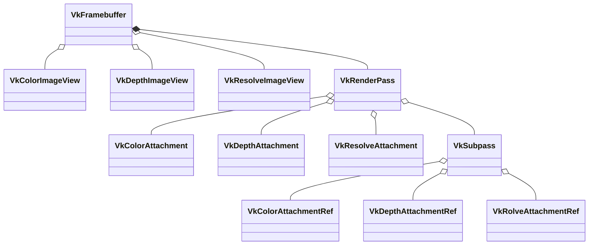
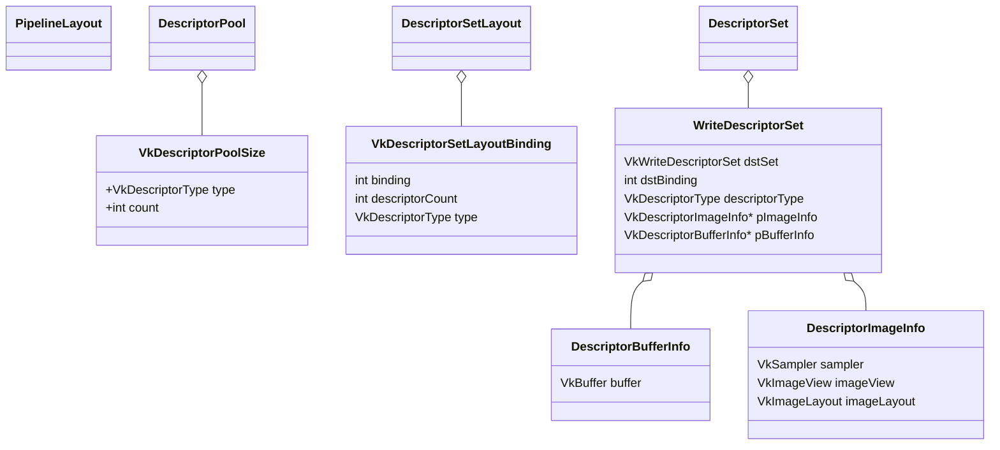

## Misc

```mermaid
classDiagram
class VkFramebuffer
class VkColorImageView
class VkDepthImageView
class VkResolveImageView

VkFramebuffer o--  VkColorImageView
VkFramebuffer o--  VkDepthImageView
VkFramebuffer o--  VkResolveImageView

class VkRenderPass
class VkColorAttachment
class VkDepthAttachment
class VkResolveAttachment

VkRenderPass o-- VkColorAttachment
VkRenderPass o-- VkDepthAttachment
VkRenderPass o-- VkResolveAttachment

class VkSubpass
class VkColorAttachmentRef
class VkDepthAttachmentRef
class VkRolveAttachmentRef

VkSubpass o-- VkColorAttachmentRef
VkSubpass o-- VkDepthAttachmentRef
VkSubpass o-- VkRolveAttachmentRef

VkRenderPass o-- VkSubpass
VkFramebuffer *-- VkRenderPass

```

```mermaid
classDiagram
class PipelineLayout
class DescriptorPool
class VkDescriptorPoolSize{
	+VkDescriptorType type
	+int count
}
DescriptorPool o-- VkDescriptorPoolSize

class DescriptorSetLayout
class VkDescriptorSetLayoutBinding{
	int binding
	int descriptorCount
	VkDescriptorType type
}

DescriptorSetLayout o-- VkDescriptorSetLayoutBinding

class DescriptorSet

class WriteDescriptorSet{
	VkWriteDescriptorSet dstSet
	int dstBinding
	VkDescriptorType descriptorType
	VkDescriptorImageInfo* pImageInfo
	VkDescriptorBufferInfo* pBufferInfo
}

class DescriptorBufferInfo{
	VkBuffer buffer
}

class DescriptorImageInfo{
	VkSampler	sampler
	VkImageView	imageView
	VkImageLayout	imageLayout
}

DescriptorSet o-- WriteDescriptorSet
WriteDescriptorSet o-- DescriptorBufferInfo
WriteDescriptorSet o-- DescriptorImageInfo
```

### 问题

1. Example和Demo中的左右手坐标系？

   Example：左手坐标系

   Demo：右手坐标系

2. 
