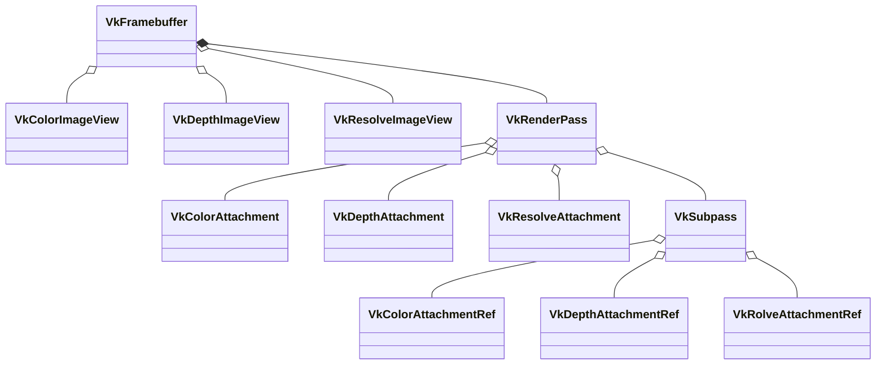
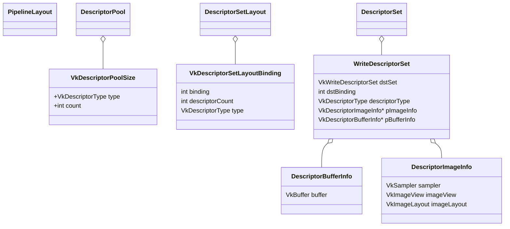

## Misc





```c
validation layer: Validation Error: [ VUID-VkGraphicsPipelineCreateInfo-layout-00756 ] Object 0: handle = 0xdcc8fd0000000012, type = VK_OBJECT_TYPE_SHADER_MODULE; Object 1: handle = 0xd175b40000000013, type = VK_OBJECT_TYPE_PIPELINE_LAYOUT; | MessageID = 0x45717876 | vkCreateGraphicsPipelines(): pCreateInfos[0] Set 3 Binding 0 in shader (VK_SHADER_STAGE_FRAGMENT_BIT) uses descriptor slot (expected `VK_DESCRIPTOR_TYPE_COMBINED_IMAGE_SAMPLER`) but not declared in pipeline layout The Vulkan spec states: layout must be consistent with all shaders specified in pStages (https://vulkan.lunarg.com/doc/view/1.3.243.0/windows/1.3-extensions/vkspec.html#VUID-VkGraphicsPipelineCreateInfo-layout-00756)
validation layer: Validation Error: [ VUID-VkGraphicsPipelineCreateInfo-layout-00756 ] Object 0: handle = 0xdcc8fd0000000012, type = VK_OBJECT_TYPE_SHADER_MODULE; Object 1: handle = 0xd175b40000000013, type = VK_OBJECT_TYPE_PIPELINE_LAYOUT; | MessageID = 0x45717876 | vkCreateGraphicsPipelines(): pCreateInfos[0] Set 3 Binding 1 in shader (VK_SHADER_STAGE_FRAGMENT_BIT) uses descriptor slot (expected `VK_DESCRIPTOR_TYPE_COMBINED_IMAGE_SAMPLER`) but not declared in pipeline layout The Vulkan spec states: layout must be consistent with all shaders specified in pStages (https://vulkan.lunarg.com/doc/view/1.3.243.0/windows/1.3-extensions/vkspec.html#VUID-VkGraphicsPipelineCreateInfo-layout-00756)
validation layer: Validation Error: [ VUID-VkGraphicsPipelineCreateInfo-layout-00756 ] Object 0: handle = 0xdcc8fd0000000012, type = VK_OBJECT_TYPE_SHADER_MODULE; Object 1: handle = 0xd175b40000000013, type = VK_OBJECT_TYPE_PIPELINE_LAYOUT; | MessageID = 0x45717876 | vkCreateGraphicsPipelines(): pCreateInfos[0] Set 3 Binding 2 in shader (VK_SHADER_STAGE_FRAGMENT_BIT) uses descriptor slot (expected `VK_DESCRIPTOR_TYPE_COMBINED_IMAGE_SAMPLER`) but not declared in pipeline layout The Vulkan spec states: layout must be consistent with all shaders specified in pStages (https://vulkan.lunarg.com/doc/view/1.3.243.0/windows/1.3-extensions/vkspec.html#VUID-VkGraphicsPipelineCreateInfo-layout-00756)

```

